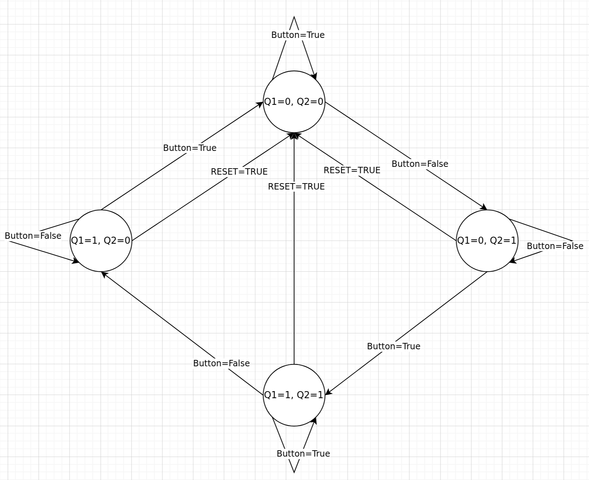

# General circuits

## RS latch

| R | S | Q
|-- |-- |--
| 0 | 0 | Hold
| 0 | 1 | 1
| 1 | 0 | 0
| 1 | 1 | Undefined


## Mono-stable 555 timer (Debouncer)

This circuit is used to debounce a push button.


## Toggle circuit



| RESET | Q1 | Q2 | Button | Q1n | Q2n | S1 | R1 | S2 | R2
|--     |--  |--  |--      |--   |--   |--  |--  |--  |--
| 0     | 0  | 0  | 0      | 0   | 1   | 0  | X  | 1  | 0
| 0     | 0  | 0  | 1      | 0   | 0   | 0  | X  | 0  | X
| 0     | 0  | 1  | 0      | 0   | 1   | 0  | X  | X  | 0
| 0     | 0  | 1  | 1      | 1   | 1   | 1  | 0  | X  | 0
| 0     | 1  | 0  | 0      | 1   | 0   | X  | 0  | 0  | X
| 0     | 1  | 0  | 1      | 0   | 0   | 0  | 1  | 0  | X
| 0     | 1  | 1  | 0      | 1   | 0   | X  | 0  | 0  | 1
| 0     | 1  | 1  | 1      | 1   | 1   | X  | 0  | X  | 0
| 1     | 0  | 0  | 0      | 0   | 0   | 0  | X  | 0  | X
| 1     | 0  | 0  | 1      | 0   | 0   | 0  | X  | 0  | X
| 1     | 0  | 1  | 0      | 0   | 0   | 0  | X  | 0  | 1
| 1     | 0  | 1  | 1      | 0   | 0   | 0  | X  | 0  | 1
| 1     | 1  | 0  | 0      | 0   | 0   | 0  | 1  | 0  | X
| 1     | 1  | 0  | 1      | 0   | 0   | 0  | 1  | 0  | X
| 1     | 1  | 1  | 0      | 0   | 0   | 0  | 1  | 0  | 1
| 1     | 1  | 1  | 1      | 0   | 0   | 0  | 1  | 0  | 1

```
S1 = !RESET & !Q1 & Q2 & Button
R1 = (!RESET & Q1 & !Q2 & Button) | RESET
S2 = !RESET & !Q1 & !Q2 & !Button
R2 = (!RESET & Q1 & Q2 & !Button) | RESET
```

