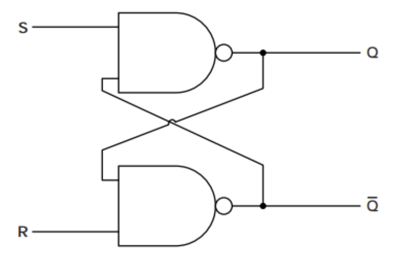

# General circuits

## RS latch

### From transistors

| R | S | Q
|-- |-- |--
| 0 | 0 | Hold
| 0 | 1 | 1
| 1 | 0 | 0
| 1 | 1 | Undefined

### From NAND-gates

| S | R | Q
|-- |-- |--
| 0 | 0 | Hold
| 0 | 1 | 0
| 1 | 0 | 1
| 1 | 1 |Undefined

## JK flip-flop

## Toggle circuit

## Mono-stable 555 timer (Debouncer)

This circuit is used to debounce a push button.

