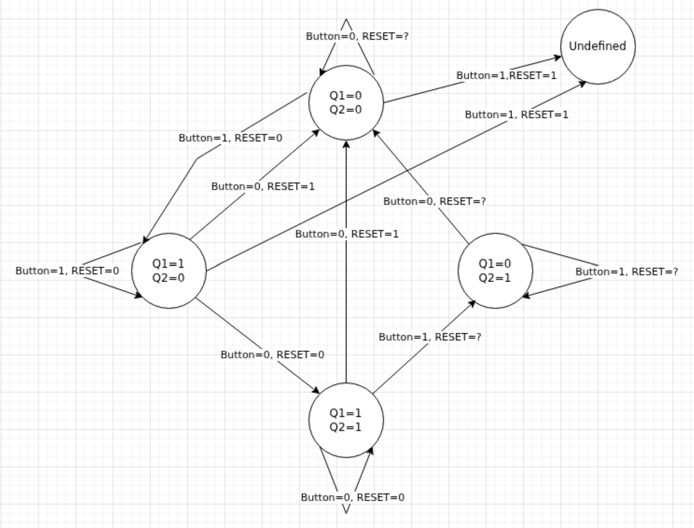

# Electronics - Clock & Power

I wanted to have a devise to encapsulate the clock circuits, and since it seems to be the first devise in the design, it also caters for serving the power circuits. See the [general](../0.1-general/README.md) circuits for debouncing the *Manual Pulse* push button, and the *toggle* circuit for the *Enable/Disable* push button.

## Panel

We have a panel for this device where we can control various parameters
* A connector for the AC Adapter
* A box where we can plug in the 9 V battery
* A switch to flip between *AC Adapter* power, or the *9V battery*
* A switch to switch the device *on/off*
* An LED to show whether the devise is ON
* A push button to switch between 3 different operating modes, Manual Pulse, Slow variable clock, and fast fixed clock
* A push button to pulse the manual clock
* A push button to toggle between *Enabled* and *Disabled*. On *RESET*, or *Change of operating mode*, this will automatically revert to *Disabled*.
* Three LED's to show what the current mode is
* An LED to show whether the devise is enabled or not
* An LED to show the clock pulsed
* An LED to show the RESET signal
* An output socket to connect to the *motherboard* devise.

The *Push buttons* and *LED* circuits are as follows, with 3 push button circuits and 7 LED circuits, where one circuit input is just *Vcc* to show whether it is powered on.


The panel has an *output* socket supplying Vcc, GND, the RESET signal, and the CLK signal to the rest of the computer. The *output* socket has the following layout (where the top is near the RESET and CLK LED's)
| Colour | Label | Comment
|-- |-- |--
| Red | Vcc | 5.055 V
| Black | GND | 0 V
| Blue | CLK | *On* when clock is *High*
| Yellow | RESET | *On* when computer is resetting

## Power circuit

I wanted to operate at 5V, but want to be able to use AC or a 9V batery as supply. I acomplish this by using a voltage regulator design, and some switches.


## Reset signal

The entire computer will require a reset signal to reset the computer when the power comes on. This signal should last longer than the initial chaos that occur when the devise is switched on, so that we can be certain the entire computer *starts* at a well defined and known state. The *reset signal* is high for around 80 to 100 milliseconds after the power was switched on. A dip in power of around 50 milliseconds might trigger the signal afresh.


## Clock out

### Logical Circuit

We're using transistors for the single 3 way NAND and the NOR gates, both to illustrate and to save on chips.


We'll add an output transistor, simmular to the *Reset* circuit, to boost the output and avoid the voltage divider.


### Truth table

The modes are exclusive, so all states where more than one mode is active is invalid, cannot happen and will be ignored.

| Mode=Manual | Mode=Variable | Mode=Fast | Manual Button | Variable CLK | Fast CLK | A | B | C | D
|-- |-- |-- |-- |-- |-- |-- |-- |-- |--
| 0 | 0 | 1 | X | X | 0 | 1 | 1 | 1 | 0
| 0 | 0 | 1 | X | X | 1 | 1 | 1 | 0 | 1
| 0 | 1 | 0 | X | 0 | X | 1 | 1 | 1 | 0
| 0 | 1 | 0 | X | 1 | X | 1 | 0 | 1 | 1
| 1 | 0 | 0 | 0 | X | X | 1 | 1 | 1 | 0
| 1 | 0 | 0 | 1 | X | X | 0 | 1 | 1 | 1

```
D = (Mode=Manual & ManualButton) | (Mode=Variable & VariableCLK) | (Mode=Fast & FastCLK)
E = !D | !Enabled
CLK = !(E | RESET) = !E & !RESET = !(!D | !Enabled) & !RESET = D & Enabled & !RESET
```

| D | Enabled | RESET | CLK
|-- |-- |-- |--
| 0 | 0 | 0 | 0
| 0 | 0 | 1 | 0
| 0 | 1 | 0 | 0
| 0 | 1 | 1 | 0
| 1 | 0 | 0 | 0
| 1 | 0 | 1 | 0
| 1 | 1 | 0 | 1
| 1 | 1 | 1 | 0

## Toggle circuit

### NAND-gate SR latch

| S | R | Q
|-- |-- |--
| 0 | 0 | Undefined
| 0 | 1 | 0
| 1 | 0 | 1
| 1 | 1 | Hold

### Master-slave setup

```
Out = Q2
S1 = !RESET & (!Button | Q2') = !(RESET | !(!Button | Q2'))
R1 = !Button | Q2  = !(Button & Q2')
S2 = Button | Q1   = !(!Button & Q1')
R2 = Button | Q1'  = !(!Button & Q1)
```

| Button | RESET | S1  | R1 | Latch 1    | S2 | R2  | Latch 2
|--      |--     |--   |--  |--          |--  |--   |--
| 0      | 0     | 1   | 1  | Hold       | Q1 | Q1' | Latch SR1
| 0      | 1     | 0   | 1  | Reset      | 0  | 1   | Reset
| 1      | 0     | Q2' | Q2 | Invert SR2 | 1  | 1   | Hold
| 1      | 1     | 0   | Q2 | Invert SR2 | 1  | 1   | Hold

#### State transitions

  

#### Circuit


